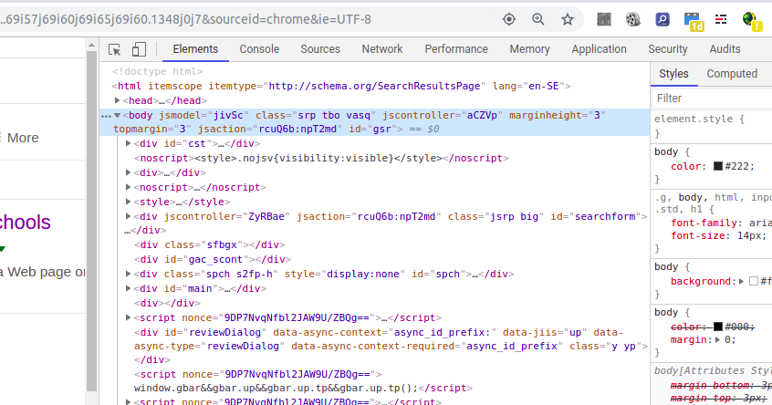

# Web Development – Javascript mini-lab

In this workshop you will get started with the basics of JavaScript. At your disposal is an HTML file [`sample_page.html`](sample_page.html) which will be the document we will be working on throughout. It contains the boilerplate HTML elements, a `div` and a `p` element with some text. 

### Interactive JavaScript
Start out by opening the document in your browser and also opening the your browser's *Developer Tools*. In most browsers this can be done by pressing `Shift` +`Ctrl` + `I` (Windows/Linux) or `Cmd` + `Shift` + `C` (Mac). If it doesn't work, check [this page](https://debugbrowser.com), it has instructions for the most common browsers. If you've done it correctly you should see something like this (this is Chrome's dev. tool, it might look a bit different on other browsers):



The tabs we are focusing on first is "Elements" and "Console". *Elements*  show us the current structure of our HTML document. *Console* allows us to dynamically write JavaScript which will be applied to the document. Head over to the *Console* tab and write the following:
```javascript
let paragraph = document.getElementById("my-paragraph");
```
press Enter and then write:
```javascript
paragraph;
```
You should now see that the variable *paragraph* contains our paragraph element. Congratulations, you just successfully wrote some JavaScript! But, if you reload the page and write `paragraph;` again you will see that the variable is no longer is defined.

### JavaScript in HTML
Of course, we don't want to write the JavaScript manually every time we load a page so let's do another approach where we include the JavaScript in the HTML instead.

Head over to the sample_page.html (open it in your editor/IDE) and write a `<script>` element inside the `<body>` element *at the end*. And inside the `<script>` write the code we wrote in the console before:

```javascript
let paragraph = document.getElementById("my-paragraph");
```
If you now refresh the page in the browser and write `paragraph;` in the console you will see that the variable is defined, even when you reload the page. That means the JavaScript that is written in the HTML is run every time we load the document.

**Question I**
 What happens if we move the  `<script>` element to the beginning of the `<body>` element instead of the end? And why do you think this happens? 

### JavaScript in separate file
The problem with writing JavaScript code inside the HTML is that it makes the document harder to read since it mixes code for structure and code for behaviour. It also makes it harder to reuse the same JavaScript code for other documents. So it is generally considered best practice to write the JavaScript in a separate file and linking to it in the HTML instead.

Create a new file called `script.js` in the same folder as your HTML file. Move the contents of the `<script>`  element (but not the `<script>` element itself) to your newly created script file. Afterwards, you can remove the `<script>` element. Now link to the script file in the HTML file by writing (inside the `<head>` element):
```
<script src="script.js"></script>
```
And if we go back to the browser, refresh the page and write `paragraph;` in the console, we'll see that the variable is...

...null

If you made a good guess at Question I you should be able to figure out what happened here as well. That's right – the script is executed before the `<p>` element is loaded so it cannot find the element and therefore, `getElementById` returns null.

The solution to this problem is to:
**1:** Wrap your code in a function, so:
```javascript
let paragraph = document.getElementById("my-paragraph");
```
becomes
```javascript
function main() {
    let paragraph = document.getElementById("my-paragraph");
}
```
**2:** Add the following line below:
```
document.addEventListener("DOMContentLoaded", main);
```
You don't have to worry too much about what the second line does, we'll cover it eventually. Refresh your browser, write `paragraph` in the console and if you've done everything correctly you should see...

...undefined. Well this didn't go as expected... or did it?

**Question II**
Why does it show undefined? Did the main function not run? And why is this actually a desired behaviour? Tip: this doesn't have to do with JavaScript specifically, but programming in general. Java also has its variation of this rule.

To come around this problem (which isn't actually a problem – it's a feature :)) we can have JavaScript print the element to the console for us. Just add (in the main function):
```javascript
console.log(paragraph);
```
And if you refresh the page you will see that the`<p>` element is already printed out in the console. And if you try to write `paragraph` it will be undefined, which it should be.

### Changing properties of elements
Now that we know how to execute JavaScript we can start having some real fun!

**Task**
Write a piece of JavaScript code that sets the text of the `<p>` element to your favourite quote instead of the random text.

Relevant methods: *innerText, textContent*

#### Event Listeners
The thing about changing elements is that we can't seem to say exactly when we wan't it to happen. It just happens instantly, but what if we want it to happen after we have clicked on the element?

Read MDN's [Introduction to events](https://developer.mozilla.org/en-US/docs/Learn/JavaScript/Building_blocks/Events) up until (and including) the *"A simple example"* section.

If you look through their example, the important thing to learn is that the `onclick` property should be set to a function which is the function that will be run when the user clicks the element. Which you can see in their example: `btn.onclick = function () {...`

It might seem a bit complicated. The reason for that is their way of setting the `onclick` property. They set to a function which they also define on the same line. What we can do instead is define a function on some previous line, give it a variable name and then just use the variable name instead when we set the `onclick` property: `btn.onclick = varName;`

**Task 2**

1. Start by moving your code that sets the text of the `<p>` element to it's own function.
1. Now in the main function, you should have code that gets the paragraph element and sets its `onclick` property to the name of the function you created in the previous step.

If you've done the above successfully you should now see that the text changes only when you've clicked it. Congratulations, you've successfully used an event listener. But this is not the first time, if you look at this line again:
```javascript
document.addEventListener("DOMContentLoaded", main);
```
You can tell that an event listener is also used here. The `onclick` we used earlier was attached to the paragraph, but on this line we are adding an event listener to the entire document. And what event are we listening for? In our paragraph we were listening for a click but here, we are listening for a "DOMContentLoaded" which is basically a signal that is sent out when the document structure has been properly loaded. So what this line does is that it runs the main function only *after* all the elements in the HTML document has been loaded so that we can make sure that when we use `getElementById` we can find the elements we're looking for.

### More fun
If you've made it this far, you are well on your way to becoming the all-knowing JavaScript Guru you've always dreamt of being. Time for the final task!

**Task 3**
Add three buttons in the html:
- One button with the text "remove" which, when clicked, should remove the paragraph.
- One button with the text "add" which, when clicked, adds a paragraph with a custom text.
- One button with the text "makeUgly" which, when clicked, adds some random paragraphs (preferably out of order and in different sizes), changes the colour of the paragraphs, the div and the body in a way that really hurts the eyes. Bonus points if you randomly add horribly pixelated images and flashing colours. Use inspiration from wherever you can, for example [this lovely eyesore](http://thebiguglywebsite.com/). The uglier you make the site, the better!

Some elevant methods: *innerHTML, insertAdjacentHTML*
